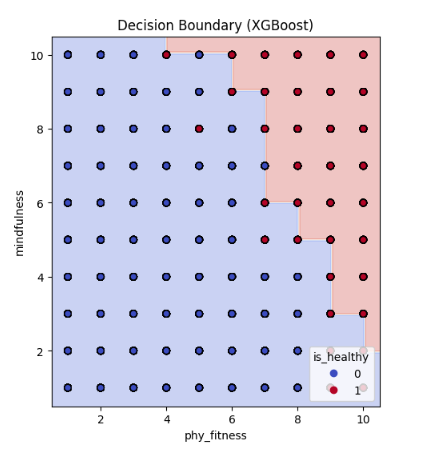

# 🏆 Fitness & Lifestyle Prediction Model - SleepyHeads 🏋‍♂💤  
This project aims to predict whether an individual is *healthy or not* based on various physical and lifestyle attributes such as fitness level, diet preferences, activity level, sleep habits, mindfulness, and career. We explore multiple machine learning models and compare their performances to determine the best classifier.  

## 🚀 Project Overview  
- *Dataset*: 6,000 entries containing fitness, lifestyle, and mindfulness-related features.  
- *Objective*: Classify individuals as *healthy (1) or unhealthy (0)* using machine learning models.  
- *Models Used*:  
  ✅ Support Vector Machine (SVM)  
  ✅ Random Forest  
  ✅ XGBoost  

## 📊 Performance Comparison  
We compare the performance of different models using accuracy scores and decision boundary visualizations.  

### *1️⃣ Decision Boundary Comparisons*  
Here’s how each model separates healthy and unhealthy individuals based on *Physical Fitness* and *Mindfulness*:  

#### *SVM Decision Boundary*  
  

#### *Random Forest Decision Boundary*  
  

#### *XGBoost Decision Boundary*  
  

### *2️⃣ Accuracy Scores*  
| Model         | Accuracy  |
|--------------|----------|
| *SVM*      | 98.25%    |
| *Random Forest* | 97.08%  |
| *XGBoost*  | *98.42%* ✅ |

#### *Performance Comparison*  
  

XGBoost outperforms the other models in terms of accuracy and decision boundary clarity.  

## 🛠 How to Run  
1. Clone the repository:  
   ```
   git clone https://github.com/lakshitaa-chellaramani/sleepyheads_innovize-2025
   
2. Install dependencies:  
   ```
   pip install -r requirements.txt
   
3. Run in *Google Colab*:  
   - [Colab Notebook](https://colab.research.google.com/drive/16uW7SvsvN679M-3972_mR2Rgmu0rtXI-?usp=sharing)

## 🏁 Conclusion  
- *XGBoost* achieved the highest accuracy (98.42%) and the clearest decision boundary.  
- The model effectively distinguishes between healthy and unhealthy individuals based on key lifestyle factors.  
- Future improvements could include hyperparameter tuning, feature engineering, and testing on real-world data.  

---
💡 *Built for the Innovize Hackathon | SleepyHeads Team 💤*
